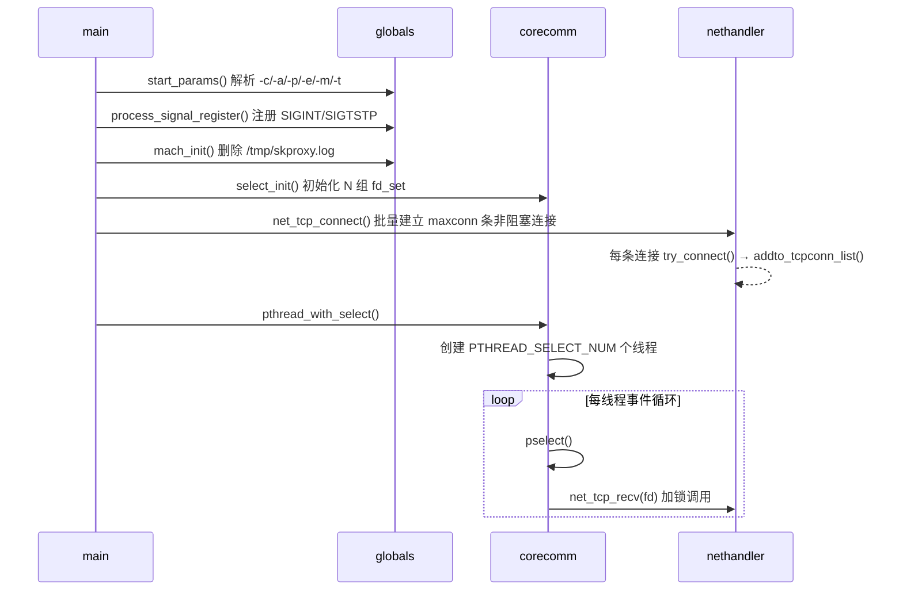
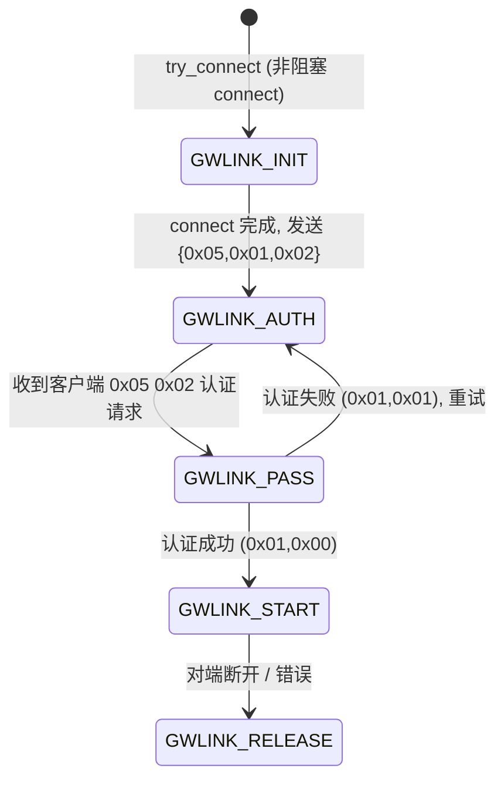
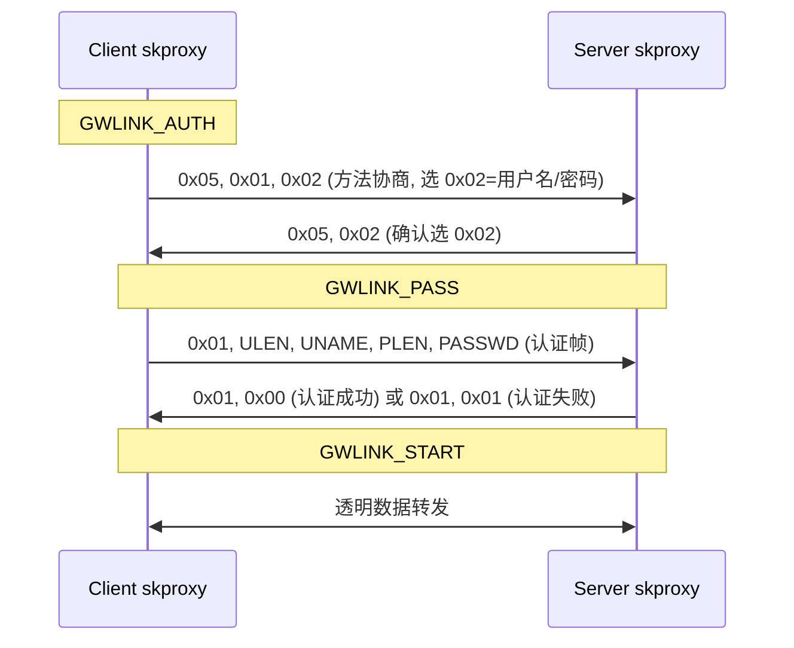
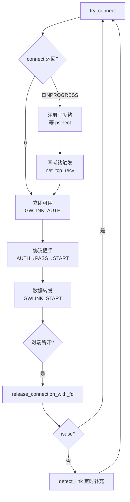

# skproxy 设计与使用文档

## 目录

- [1. 项目概述](#1-项目概述)
- [2. 运行模式](#2-运行模式)
- [3. 架构总览](#3-架构总览)
- [4. 核心数据结构](#4-核心数据结构)
- [5. 网关链路状态机](#5-网关链路状态机)
- [6. 池连接认证协议](#6-池连接认证协议)
- [7. 线程模型与事件循环](#7-线程模型与事件循环)
- [8. 连接池管理](#8-连接池管理)
- [9. 数据转发](#9-数据转发)
- [10. 构建与运行](#10-构建与运行)
- [11. 命令行参考](#11-命令行参考)
- [12. 日志系统](#12-日志系统)
- [13. 配置常量](#13-配置常量)
- [14. 注意事项](#14-注意事项)

---

## 1. 项目概述

**skproxy** 是一个多线程 TCP 代理网关。它向远程服务器预先建立并维护一个持久化、非阻塞的 TCP 连接池，在客户端与服务器之间透明转发流量。

### 核心能力

| 能力 | 说明 |
|------|------|
| 连接池复用 | 预建 200 条 TCP 连接，客户端到达时立即可用 |
| 透明转发 | 配对连接间双向透传，零协议感知 |
| 链路认证 | skproxy↔远程服务器之间的用户名/密码或 MAC 地址认证 |
| 端口映射 | `-p target:listen` 将本地端口映射到远端目标端口，通过 2 字节头路由 |

---

## 2. 运行模式

skproxy 按 `-c` 和 `-p` 参数组合决定角色：

| 模式 | 命令 | 拓扑 |
|------|------|------|
| **Server** | `skproxy -l port [-a auth]` | client → skproxy:port →[2字节头路由]→ target |
| **Client** | `skproxy -c host:port -p target:listen [-a auth]` | client → skproxy:listen →[池]→ host:port → target |

Server 模式接受来自另一台 skproxy 的池连接。Client 模式通过 `-p target:listen` 创建本地监听，连接时向池连接发送 2 字节目标端口头。可多次指定 `-p`。

---

## 3. 架构总览

### 3.1 文件组成

```
socketproxy/
├── main.c             入口：启动流程编排
├── globals.h / .c     全局状态、参数解析、信号、工具函数
├── nethandler.h / .c  网络核心：连接建立、协议状态机、数据收发
├── netlist.h / .c     连接链表：增/删/查
├── corecomm.h / .c    多线程 pselect 事件循环
├── mtypes.h           基础类型（int8、uint8 等）
├── dlog.h             分级日志宏
├── config.mk          交叉编译工具链配置
├── Makefile           顶层构建
└── test/
    ├── Makefile
    ├── client.c              TCP 测试客户端
    ├── target.c       回显服务器
```

### 3.2 启动流程



---

## 4. 核心数据结构

### 4.1 连接节点 `tcp_conn_t`

```c
typedef struct TCPConn {
    int fd;                          // socket 文件描述符
    int pt_pos;                      // 归属线程索引（0..N-1）
    gwlink_status_e gwlink_status;   // 当前协议状态
    int port;                        // 本地端口（getsockname 获取）
    char host_addr[64];              // 对端地址
    int host_port;                   // 对端端口
    struct sockaddr_in host_in;      // 对端 sockaddr（预解析，避免重复 DNS）
    uint8 *data;                     // 待发送缓冲（对端未就绪时堆分配）
    int len;                         // 缓冲数据长度
    void *extdata;                   // → ext_conn_t，配对信息
    struct TCPConn *next;            // 单向链表指针
} tcp_conn_t;
```

### 4.2 扩展数据 `ext_conn_t`（双向隧道）

```c
typedef struct ExtConnData {
    tcp_conn_t *toconn;   // 配对的对端连接
    enum ConnWay way;     // CONN_WITH_SERVER（0）或 CONN_WITH_CLIENT（1）
    int isuse;            // 是否曾用于数据转发（决定断线是否立即重连）
    int target_port;      // 目标端口（-1 未设置，server 端从 2 字节头读取）
    uint8 head_buf[2];    // 头部累积缓冲区（server 端跨 recv 累积）
    int head_len;         // 已累积的头部字节数（0~2）
} ext_conn_t;
```

**配对关系示意：**

```
tcp_conn_t (客户端, way=CLIENT)          tcp_conn_t (服务器, way=SERVER)
  ├─ extdata → ext_conn_t                 ├─ extdata → ext_conn_t
  │   ├─ toconn ──────────────────────▶   │   ├─ toconn ──────────────────────▶
  │   ├─ way = CONN_WITH_CLIENT           │   ├─ way = CONN_WITH_SERVER
  │   └─ isuse                           │   └─ isuse
  └─ fd                                  └─ fd
```

### 4.3 连接链表

单向链表，遍历 O(n)，容量上限 `TRANS_TCP_CONN_MAX_SIZE = 65536`。

| 操作 | 说明 |
|------|------|
| `new_tcpconn(fd, status, port, host, host_port, extdata)` | DNS 解析 + calloc 节点 |
| `addto_tcpconn_list(tconn)` | 尾插法追加 |
| `queryfrom_tcpconn_list(fd)` | 按 fd 线性查找 |
| `queryfrom_tcpconn_list_with_localport(port)` | 按本地端口查找 |
| `delfrom_tcpconn_list(fd)` | 删除节点，free extdata + data |

---

## 5. 网关链路状态机

每条服务器方向的连接按以下状态迁移，由 `net_tcp_recv()` 驱动。



### 状态处理速查

| 状态 | 触发条件 | 动作 |
|------|---------|------|
| `GWLINK_INIT` | fd 写就绪（异步 connect 完成） | 检查 SO_ERROR → 切换 O_NONBLOCK → 发认证问候 / 进 START |
| `GWLINK_AUTH` | 收到数据 | 解析 SOCKS5 方法协商，构建 user:pass 认证帧 |
| `GWLINK_PASS` | 收到认证响应 | 成功→进 START；失败→退回 AUTH |
| `GWLINK_START` | 数据到达 | 有配对→转发；无配对→读 2 字节头连接目标 |
| `GWLINK_RELEASE` | 任何错误路径 | 关闭 fd，从链表删除，触发重连评估 |

---

## 6. 池连接认证协议

skproxy 池连接使用 SOCKS5 风格的用户名/密码认证握手（`GWLINK_WITH_SOCKS5_PASS`）。

### 6.1 握手时序



### 6.2 认证凭据

| 方式 | 参数 | 说明 |
|------|------|------|
| 用户名/密码 | `-a user:pass` | 默认 `admin:admin` |
| MAC 地址 | `-e eth0` | 自动生成 user=`<MAC><4位随机十六进制>`，pass 为空 |


---

## 7. 线程模型与事件循环

### 7.1 线程架构

```mermaid
graph TD
    subgraph "corecomm.c"
        M[pthread_mutex_t mutex]
        R0[fd_set rdfs[0] + wtfs[0]]
        R1[fd_set rdfs[1] + wtfs[1]]
        RN[fd_set rdfs[N-1] + wtfs[N-1]]
    end

    subgraph "PTHREAD_SELECT_NUM 个线程"
        T0[主线程 idx=0<br/>select_excute(0)]
        T1[子线程 idx=1<br/>select_excute(1)]
        TN[子线程 idx=N-1<br/>select_excute(N-1)]
    end

    T0 --> R0
    T1 --> R1
    TN --> RN
    R0 & R1 & RN -.->|加锁| M
```

- 线程数 = `PTHREAD_SELECT_NUM`（默认 1，可编译期覆盖）
- 每个线程持有**独立**的 `fd_set` 和 `maxfd`，避免 pselect 数据竞争
- fd 分配策略：`get_query_indexpp()` 轮询（Round-Robin）分配到各线程
- 每次 `net_tcp_recv()` 调用外层由 `pthread_mutex_lock` / `unlock` 保护
- pselect 阻塞信号 SIGALRM

### 7.2 select_listen 细节

```
pselect(timeout=动态)
  ├─ ret > 0: 有 fd 就绪
  │   ├─ 优先重试 before_fd（上次未处理完的 fd，防止饥饿）
  │   └─ 遍历 0..maxfd
  │       └─ FD_ISSET → lock → net_tcp_recv(fd) → unlock → return
  ├─ ret == 0: 超时 → time_handler(index) 补充连接池
  └─ ret < 0: 错误 → set_end(0) 退出循环
```

### 7.3 超时策略

`get_timespec()` 返回值由 `detect_link()` 动态设定：

| 场景 | 超时（秒） | 目的 |
|------|-----------|------|
| 池满 + 之前满载过 | 58–118 | 快速响应释放的空位 |
| 池未满 + 有工作史 | 58–118 | 快速补满 |
| 池空（≤5）且有工作史 | 1200–2400 | 低频保活，避免空转 |
| 首次满载 | 0（阻塞） | 等事件驱动，不唤醒 |
| 满载时再次触发 | 标记 istrigger=1 | 为下次降量做准备 |

---

## 8. 连接池管理

### 8.1 预建连接（启动时）

```
net_tcp_connect()
  for i = 0..maxconn-1:
    try_connect(-1, host_addr, host_port, CONN_WITH_SERVER)
      → socket() + fcntl(O_NONBLOCK)
      → connect()  // 非阻塞，立即返回
      → 成功 → serlink_count[pt_pos]++, 进 GWLINK_AUTH, detect_link()
      → EINPROGRESS → select_wtset(fd), 等写就绪
```

### 8.2 连接生命周期



### 8.3 连接计数

```
serlink_count[thread_idx]  ← 每个线程独立维护
get_total_serlink_count()  ← 汇总所有线程
```

- 新连接建立时 `serlink_count[pt_pos]++`
- 连接释放时 `serlink_count[pt_pos]--`
- `detect_link()` 据此判断补连接口

---

## 9. 数据转发

### 9.1 正常配对转发

```
net_tcp_recv(fd)
  → 查链表得 t_conn
  → 取 toconn = extdata->toconn
  → 存在配对:
      way==SERVER → send_with_rate_callback(t_conn, toconn, buf, nbytes, send_to_stream_call)
      way==CLIENT → send_with_rate_callback(t_conn, toconn, buf, nbytes, send_back_stream_call)
```

### 9.2 端口映射（2 字节头协议）

当服务器连接收到数据但无配对客户端时，从数据中读取 2 字节大端目标端口：

```
读取 2 字节头 → target_port = (head[0]<<8) | head[1]
try_connect("127.0.0.1", target_port, CONN_WITH_CLIENT)
  → 双向配对 extdata↔extdata
  → send_with_rate_callback 转发头部之后的负载数据
```

头部由 client 端在配对时立即发送，确保 server 在收到任何客户端数据前已读取目标端口。头部可能跨 `recv()` 调用分割——`head_buf`/`head_len` 支持累积。

**目标不可达**：当 server 无法连接目标端口时，立即释放池连接（`serlink_count--` + `release_connection_with_fd`），导致 client 端池连接断开，进而释放配对的客户端连接。客户端感知 TCP 断开。

### 9.3 指数退避重传

`send_with_rate_callback()` 在 `send()` 返回 `EAGAIN` 时：

```
初始: usleep(100μs)
每次递增:
   < 1ms   → +100μs
   < 50ms  → +1ms
   ≥ 50ms  → +100ms
```

对端未 `GWLINK_START` 时，数据先在堆上累积（`realloc`），就绪后一次性 flush。

### 9.4 速率统计

```
速率 = len * 1000 / (发送后时间 - 发送前时间) μs
显示: B/s, KB/s, MB/s, GB/s 自适应单位
```

---

## 10. 构建与运行

### 10.1 编译期开关

| 宏 | 来源 | 默认 | 作用 |
|----|------|------|------|
| `GWLINK_WITH_SOCKS5_PASS` | globals.h | 定义 | skproxy↔远程服务器链路层认证 |
| `DLOG_PRINT` | Makefile `-D` | 定义 | 写日志到 `/tmp/skproxy.log` |
| `PTHREAD_SELECT_NUM` | 编译 `-D` | 1 | select 线程数 |
| `TARGET_NAME` | Makefile `-D` | `skproxy` | 二进制文件名 |

### 10.2 构建

```bash
make                  # 构建 skproxy（gcc -O2, strip）
make V=1              # 简洁输出 [CC] / [TAR]
make V=99             # 完整编译命令
make dir=bin          # 输出到 bin/skproxy
make prefix=mips-unknown-linux-uclibc-  # MIPS 交叉编译
make clean            # 删除 .o 和二进制

# 测试程序（独立构建系统）
cd test && make       # 生成 client, target
```


### 10.3 测试

```bash
# 启动目标回显服务器
./test/target 8280 &

# Server 模式（池监听）
./skproxy -l 9001 -a admin:123456 &

# Client 模式（端口映射）
./skproxy -c 127.0.0.1:9001 -a admin:123456 -p 8280:9100 &

# 原始 TCP 客户端测试
./test/client 127.0.0.1 9100
```

数据流：`client → skproxy:9100 →[池连接 + 2字节头]→ skproxy:9001 → 127.0.0.1:8280 → target`

### 10.4 端口语义

| 端口 | 默认值 | 作用 |
|------|--------|------|
| `-c host:port` | — | 远端中继服务地址，省略则进入 server 模式 |
| `-l port` | — | 池监听端口（server 模式） |
| `-p target:listen` | — | 端口映射：client 监听 `listen`，server 转发到 `127.0.0.1:target`。可多次指定 |

> **关键**：skproxy 作为 client 角色主动连接远程池服务器，同时通过 `-p` 端口映射在本地监听客户端连接。

---

## 11. 命令行参考

### 11.1 语法

```
skproxy [-c host[:port]] [-l port] [-p target:listen]... [-a user:pass] [-e dev] [-m num] [-t daemon|print] [-h]
```

### 11.2 参数

| 参数 | 必选 | 说明 | 默认值 |
|------|------|------|--------|
| `-c host:port` | 否 | 远端地址，省略则为 server 模式 | — |
| `-l port` | 否 | 本地监听端口 | — |
| `-p target:listen` | 否 | 端口映射：本地监听 `listen`，转发到 `127.0.0.1:target`。可多次指定 | — |
| `-a user:pass` | 否 | 池连接认证凭据 | `admin:admin` |
| `-e dev` | 否 | 指定网卡，提取 MAC 生成 user | `eth0` |
| `-m num` | 否 | 连接池大小（server 模式可设 0） | `200` |
| `-t print` | 否 | 前台测试模式 | — |
| `-t daemon` | 否 | 守护进程模式 | — |
| `-h` | 否 | 显示帮助 | — |

### 11.3 示例

```bash
# Server 模式（中继服务器）
skproxy -l 1080 -a myuser:mypass

# Client 模式（本地→远端，端口映射）
skproxy -c remote:1080 -a myuser:mypass -p 8280:9100

# Client 模式多端口映射
skproxy -c 10.0.0.1:1080 -p 8280:9100 -p 8281:9101

# MAC 自动认证
skproxy -c 10.0.0.1:40000 -e eth1

# 查看帮助
skproxy -h
```

---

## 12. 日志系统

### 12.1 宏分级

| 宏 | stdout 条件 | 文件 `/tmp/skproxy.log` |
|----|------------|------------------------|
| `AI_PRINTF` | 非测试模式 (`-t print` 时静默) | 始终写入（当 `DLOG_PRINT`） |
| `AO_PRINTF` | 仅测试模式 | 始终写入（当 `DLOG_PRINT`） |
| `AT_PRINTF` | 非 daemon 模式 | 不写文件 |

### 12.2 输出样例

```
[2026-06-20 12:00:01] skproxy start, getpid=12345
[2026-06-20 12:00:01] line 238 connect 10.0.0.1:40000, current port=52341, fd=5, total=1
[2026-06-20 12:00:05] line 393: user=admin auth success, fd=5, total=200
[2026-06-20 12:00:06] 10.0.0.1:40000 ==> 192.168.1.100:80, fd=5, 1.50 MB/s
[2026-06-20 12:00:06] 10.0.0.1:40000 <== 192.168.1.100:80, fd=5, 256.3 KB/s
[2026-06-20 12:00:10] close, user=admin, fd=5, total=199
```

- `==>` 表示客户端→服务器方向
- `<==` 表示服务器→客户端方向
- 速率自动选择 B/s、KB/s、MB/s 单位

---

## 13. 配置常量

| 常量 | 值 | 位置 | 说明 |
|------|-----|------|------|
| `SERVER_TCPLINK_NUM` | 200 | globals.h | 默认连接池大小 |
| `DEFAULT_HOSTPORT` | 40000 | globals.h | 默认远程端口 |
| `DEFAULT_USER` | `admin` | globals.h | 默认认证用户 |
| `DEFAULT_PASS` | `admin` | globals.h | 默认认证密码 |
| `DEFAULT_MACDEV` | `eth0` | globals.h | 默认 MAC 设备 |
| `MAXSIZE` | 8192 | globals.h | recv 缓冲区字节数 |
| `TRANS_TCP_CONN_MAX_SIZE` | 65536 | netlist.h | 链表最大容量 |

---

## 14. 注意事项

1. **认证层次**：`GWLINK_WITH_SOCKS5_PASS` 的认证（user/pass 或 MAC）发生在 skproxy 与**远程网关服务器**之间。客户端与 skproxy 之间无额外认证层——客户端连接直接进入数据转发模式。

2. **MAC 认证机制**：使用 `-e` 时，用户名自动设为 `<12位MAC十六进制><4位随机十六进制>`，密码为空字符串。远程服务器需匹配此规则才能通过认证。

3. **守护进程**：`-t daemon` 会 fork 子进程执行 `setsid()`，父进程 `usleep(1000)` 后直接 `return 1` 退出——此时 `main()` 返回值为 1 是**正常行为**，不代表错误。

4. **重连策略差异**：
   - `isuse=1` 的连接断开 → **立即**重建（`try_connect`）
   - `isuse=0` 的连接断开 → 由 `detect_link()` 按**定时器**补充
   - 因此从未转发过数据的空闲连接不会立即补回

5. **内存使用**：`send_with_rate_callback` 在对端未就绪时通过 `realloc` 累积数据。高并发下若大量连接对端长时间不就绪，堆内存可能持续增长。

6. **线程安全边界**：连接链表操作受全局 mutex 保护，但 `serlink_count[]` 数组各线程独立访问。`extdata` 中的 `toconn` 指针存在跨线程读写——依赖 mutex 保护的 `net_tcp_recv()` 调用顺序保证安全。

7. **非线程数扩展**：当 `PTHREAD_SELECT_NUM > 1` 时，`serlink_count[]` 的分母策略（`get_max_connections_num() / PTHREAD_SELECT_NUM`）可能导致各线程配额不均衡的补充行为。

8. **端口映射协议**：Client skproxy 配对客户端连接与池连接后，立即在池连接上发送 2 字节大端目标端口头。Server skproxy 读取此头部后连接 `127.0.0.1:<target>`，然后剥离头部转发剩余数据。头部可能跨 recv() 调用到达，通过 `head_buf`/`head_len` 累积处理。

9. **错误静默处理**：`send()` 遇到 EPIPE/ECONNRESET（对端正常断开）时不打印 perror，静默释放连接。Server 模式 `time_handler()` 跳过补池（无远端可连）。

10. **目标不可达断开**：Server 端 `try_connect("127.0.0.1", target)` 失败时，释放池连接，链式关闭 client 端配对连接。
